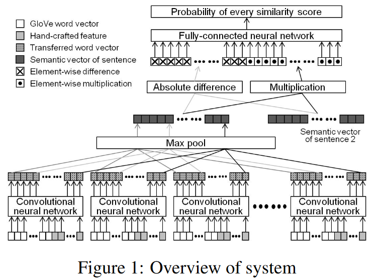

# Example: Siamese semantic similarity

We are going to use the siamese semantic similarity dataset used for the task 1 of the semeval 2016. (Agirre, E., Banea, C., Cer, D., Diab, M., Gonzalez Agirre, A., Mihalcea, R., ... & Wiebe, J. (2016). Semeval-2016 task 1: Semantic textual similarity, monolingual and cross-lingual evaluation. In SemEval-2016. 10th International Workshop on Semantic Evaluation; 2016 Jun 16-17; San Diego, CA. Stroudsburg (PA): ACL; 2016. p. 497-511.. ACL (Association for Computational Linguistics).)

The model we are going to implement is inspired by the one implemented by the team HTCI in SemEval 2017 competition (Shao, Y. (2017, August). Hcti at semeval-2017 task 1: Use convolutional neural network to evaluate semantic textual similarity. In Proceedings of the 11th International Workshop on Semantic Evaluation (SemEval-2017) (pp. 130-133).)


```python
!curl -OL http://ixa2.si.ehu.es/stswiki/images/4/40/STS2012-en-test.zip
!curl -OL http://ixa2.si.ehu.es/stswiki/images/2/2f/STS2013-en-test.zip
!curl -OL http://ixa2.si.ehu.es/stswiki/images/8/8c/STS2014-en-test.zip
!unzip -o STS2012-en-test.zip
!unzip -o STS2013-en-test.zip
!unzip -o STS2014-en-test.zip
```

      % Total    % Received % Xferd  Average Speed   Time    Time     Time  Current
                                     Dload  Upload   Total   Spent    Left  Speed
      0   326    0     0    0     0      0      0 --:--:-- --:--:-- --:--:--     0
    100  110k  100  110k    0     0  47158      0  0:00:02  0:00:02 --:--:-- 77700
      % Total    % Received % Xferd  Average Speed   Time    Time     Time  Current
                                     Dload  Upload   Total   Spent    Left  Speed
      0   326    0     0    0     0      0      0 --:--:-- --:--:-- --:--:--     0
    100 76462  100 76462    0     0  40200      0  0:00:01  0:00:01 --:--:--  104k
      % Total    % Received % Xferd  Average Speed   Time    Time     Time  Current
                                     Dload  Upload   Total   Spent    Left  Speed
      0   326    0     0    0     0      0      0 --:--:-- --:--:-- --:--:--     0
    100  460k  100  460k    0     0   106k      0  0:00:04  0:00:04 --:--:--  148k
    Archive:  STS2012-en-test.zip
      inflating: test-gold/00-readme.txt  
      inflating: test-gold/STS.gs.ALL.txt  
      inflating: test-gold/STS.gs.MSRpar.txt  
      inflating: test-gold/STS.gs.MSRvid.txt  
      inflating: test-gold/STS.gs.SMTeuroparl.txt  
      inflating: test-gold/STS.gs.surprise.OnWN.txt  
      inflating: test-gold/STS.gs.surprise.SMTnews.txt  
      inflating: test-gold/STS.input.MSRpar.txt  
      inflating: test-gold/STS.input.MSRvid.txt  
      inflating: test-gold/STS.input.SMTeuroparl.txt  
      inflating: test-gold/STS.input.surprise.OnWN.txt  
      inflating: test-gold/STS.input.surprise.SMTnews.txt  
    Archive:  STS2013-en-test.zip
      inflating: test-gs/00-readme.txt   
      inflating: test-gs/STS.gs.FNWN.txt  
      inflating: test-gs/STS.gs.OnWN.txt  
      inflating: test-gs/STS.gs.SMT.txt  
      inflating: test-gs/STS.gs.headlines.txt  
      inflating: test-gs/STS.input.FNWN.txt  
      inflating: test-gs/STS.input.OnWN.txt  
      inflating: test-gs/STS.input.headlines.txt  
      inflating: test-gs/STS.output.FNWN.txt  
      inflating: test-gs/STS.output.OnWN.txt  
      inflating: test-gs/STS.output.SMT.txt  
      inflating: test-gs/STS.output.headlines.txt  
      inflating: test-gs/correct-output.pl  
      inflating: test-gs/correlation-all.pl  
      inflating: test-gs/correlation.pl  
    Archive:  STS2014-en-test.zip
      inflating: sts-en-test-gs-2014/STS.input.deft-forum.txt  
      inflating: sts-en-test-gs-2014/correlation-noconfidence.pl  
      inflating: sts-en-test-gs-2014/STS.input.deft-news.txt  
      inflating: sts-en-test-gs-2014/STS.input.headlines.txt  
      inflating: sts-en-test-gs-2014/STS.input.images.txt  
      inflating: sts-en-test-gs-2014/STS.input.OnWN.txt  
      inflating: sts-en-test-gs-2014/STS.input.tweet-news.txt  
      inflating: sts-en-test-gs-2014/STS.output.headlines.txt  
      inflating: sts-en-test-gs-2014/sts2012-test.tgz  
      inflating: sts-en-test-gs-2014/sts2012-train.tgz  
      inflating: sts-en-test-gs-2014/sts2013-test.tgz  
      inflating: sts-en-test-gs-2014/STS.gs.deft-forum.txt  
      inflating: sts-en-test-gs-2014/STS.gs.deft-news.txt  
      inflating: sts-en-test-gs-2014/STS.gs.headlines.txt  
      inflating: sts-en-test-gs-2014/STS.gs.images.txt  
      inflating: sts-en-test-gs-2014/STS.gs.OnWN.txt  
      inflating: sts-en-test-gs-2014/STS.gs.tweet-news.txt  
      inflating: sts-en-test-gs-2014/00-readme.txt  


```python
import pandas as pd
import os
```


```python
dfs = []
for filename in os.listdir('test-gold'):
    if 'input' in filename and filename.replace('input', 'gs') in os.listdir('test-gold'):
        df = pd.read_csv('test-gold/'+filename,
                                 header=None, sep='\t', quotechar='', quoting=3)
        df['label'] = pd.read_csv('test-gold/'+filename.replace('input', 'gs'), header=None)
        dfs.append(df)
```


```python
for filename in os.listdir('test-gs'):
    if 'input' in filename and filename.replace('input', 'gs') in os.listdir('test-gs'):
        df = pd.read_csv('test-gs/'+filename,
                                 header=None, sep='\t', quotechar='', quoting=3)
        df['label'] = pd.read_csv('test-gs/'+filename.replace('input', 'gs'), header=None)
        dfs.append(df)
```


```python
for filename in os.listdir('sts-en-test-gs-2014'):
    if 'input' in filename and filename.replace('input', 'gs') in os.listdir('sts-en-test-gs-2014'):
        df = pd.read_csv('sts-en-test-gs-2014/'+filename,
                                 header=None, sep='\t', quotechar='', quoting=3)
        df['label'] = pd.read_csv('sts-en-test-gs-2014/'+filename.replace('input', 'gs'), header=None)
        dfs.append(df)
```


```python
len(dfs)
```


    14


```python
final_df = pd.concat(dfs, ignore_index=True)
print(final_df)
```

                                                          0  \
    0     The problem likely will mean corrective change...   
    1     The technology-laced Nasdaq Composite Index .I...   
    2     "It's a huge black eye," said publisher Arthur...   
    3     SEC Chairman William Donaldson said there is a...   
    4     Vivendi shares closed 1.9 percent at 15.80 eur...   
    ...                                                 ...   
    8353  the ginger in me loves that world's #1 bachelo...   
    8354         :-\ HMV gone into bankruptcy equivalent...   
    8355  Really people??? ?: Readers sue Lance Armstron...   
    8356  British Woman Sentenced to Death in Bali Drug ...   
    8357  DAILY REVIEW: Selected Letters of William Styr...   
    
                                                          1  label  
    0     He said the problem needs to be corrected befo...    4.4  
    1     The broad Standard & Poor's 500 Index .SPX inc...    0.8  
    2     "It's a huge black eye," Arthur Sulzberger, th...    3.6  
    3     "I think there's a building confidence that th...    3.4  
    4     In New York, Vivendi shares were 1.4 percent d...    1.4  
    ...                                                 ...    ...  
    8353                Prince Harry most eligible bachelor    0.8  
    8354  DealBook: British Retailer HMV Enters Equivale...    4.2  
    8355              Readers sue Armstrong for book refund    3.0  
    8356  British Grandmother Sentenced to Death for Smu...    3.8  
    8357               ?Selected Letters of William Styron?    4.0  
    
    [8358 rows x 3 columns]


```python
final_df['label'] = final_df['label']/5
final_df.columns = ['text1', 'text2', 'label']
```

## Model architecture



We are not going to use the hand-crafted features, instead we will use char embeddings per word


```python
!curl -O http://downloads.cs.stanford.edu/nlp/data/glove.6B.zip
!unzip glove.6B
!python -m gensim.scripts.glove2word2vec --input  glove.6B.50d.txt --output glove.6B.50d.w2vformat.txt
```

      % Total    % Received % Xferd  Average Speed   Time    Time     Time  Current
                                     Dload  Upload   Total   Spent    Left  Speed
      4  822M    4 36.9M    0     0  6789k      0  0:02:04  0:00:05  0:01:59 7639k^C
    Archive:  glove.6B.zip
      End-of-central-directory signature not found.  Either this file is not
      a zipfile, or it constitutes one disk of a multi-part archive.  In the
      latter case the central directory and zipfile comment will be found on
      the last disk(s) of this archive.
    note:  glove.6B.zip may be a plain executable, not an archive
    Archive:  glove.6B.ZIP
      End-of-central-directory signature not found.  Either this file is not
      a zipfile, or it constitutes one disk of a multi-part archive.  In the
      latter case the central directory and zipfile comment will be found on
      the last disk(s) of this archive.
    note:  glove.6B.ZIP may be a plain executable, not an archive
    /home/jian01/.pyenv/versions/3.9.5/lib/python3.9/runpy.py:127: RuntimeWarning: 'gensim.scripts.glove2word2vec' found in sys.modules after import of package 'gensim.scripts', but prior to execution of 'gensim.scripts.glove2word2vec'; this may result in unpredictable behaviour
      warn(RuntimeWarning(msg))
    2022-02-21 22:10:10,051 - glove2word2vec - INFO - running /home/jian01/.pyenv/versions/meli/lib/python3.9/site-packages/gensim/scripts/glove2word2vec.py --input glove.6B.50d.txt --output glove.6B.50d.w2vformat.txt
    2022-02-21 22:10:13,681 - glove2word2vec - INFO - converting 400000 vectors from glove.6B.50d.txt to glove.6B.50d.w2vformat.txt
    2022-02-21 22:10:20,498 - glove2word2vec - INFO - Converted model with 400000 vectors and 50 dimensions


```python
!pip install nltk
```

    Requirement already satisfied: nltk in /home/jian01/.pyenv/versions/3.9.5/envs/meli/lib/python3.9/site-packages (3.5)
    Requirement already satisfied: click in /home/jian01/.pyenv/versions/3.9.5/envs/meli/lib/python3.9/site-packages (from nltk) (8.0.3)
    Requirement already satisfied: joblib in /home/jian01/.pyenv/versions/3.9.5/envs/meli/lib/python3.9/site-packages (from nltk) (1.1.0)
    Requirement already satisfied: regex in /home/jian01/.pyenv/versions/3.9.5/envs/meli/lib/python3.9/site-packages (from nltk) (2022.1.18)
    Requirement already satisfied: tqdm in /home/jian01/.pyenv/versions/3.9.5/envs/meli/lib/python3.9/site-packages (from nltk) (4.62.3)
    WARNING: You are using pip version 21.1.1; however, version 22.0.3 is available.
    You should consider upgrading via the '/home/jian01/.pyenv/versions/3.9.5/envs/meli/bin/python3.9 -m pip install --upgrade pip' command.


```python
import nltk
nltk.download('punkt')
```

    [nltk_data] Downloading package punkt to /home/jian01/nltk_data...
    [nltk_data]   Package punkt is already up-to-date!


    True


```python
from nltk import word_tokenize

def word_tokenizer(text):
    return word_tokenize(text.lower())

final_df['text1'].map(word_tokenizer).map(lambda x: len(x)).quantile(0.95)
```


    24.0


```python
from gianlp.models import CharPerWordEmbeddingSequence, RNNDigest, KerasWrapper, PreTrainedWordEmbeddingSequence
```

    WARNING:nlp_builder:The NLP builder disables all tensorflow-related logging


### Word embedding sequence


```python
word_emb = PreTrainedWordEmbeddingSequence("glove.6B.50d.w2vformat.txt", 
                                           tokenizer=word_tokenizer, 
                                           sequence_maxlen=24)
```


```python
word_emb.outputs_shape
```


    (24, 50), float32


### Char per word sequence


```python
help(CharPerWordEmbeddingSequence.__init__)
```

    Help on function __init__ in module gianlp.models.text_representations.chars_per_word_sequence:
    
    __init__(self, tokenizer: Callable[[str], List[str]], embedding_dimension: int = 256, word_maxlen: int = 30, char_maxlen: int = 80, min_freq_percentile: int = 5, random_state: int = 42)
        :param tokenizer: a tokenizer function that transforms each string into a list of string tokens
                        the function must support serialization through pickle
        :param embedding_dimension: The char embedding dimension
        :param word_maxlen: the max length for word sequences
        :param char_maxlen: the max length for chars within a word
        :param min_freq_percentile: minimum percentile of the frequency for keeping a char.
                                    If a char has a frequency lower than this percentile it
                                    would be treated as unknown.
        :param random_state: random seed
    


```python
char_per_word = CharPerWordEmbeddingSequence(tokenizer=word_tokenizer, embedding_dimension=16, 
                                             word_maxlen=24, char_maxlen=10)
char_per_word.outputs_shape
```


    (24, 10, 16), float32


### Char digest

The RNNDigest knows how to process the input in a time-distributed manner implicitly (ndims of `char_per_word` is 3 and plain keras RNN expects ndim 2)


```python
char_digest_per_word = RNNDigest(char_per_word, units_per_layer=10, rnn_type='gru', stacked_layers=1)
char_digest_per_word.outputs_shape
```

    WARNING:nlp_builder:If the model and wrapper inputs mismatch it will only be noticed when building, before that output shape is an estimate and does not assert inputs.


    (24, 10), float32


### Encoder

We will convolute the sequences. The input works as an implicit concatenate with the library


```python
from tensorflow.keras.layers import Dense, Conv1D, GlobalMaxPooling1D, Concatenate, Input, Multiply, Subtract, Dropout
from tensorflow.keras.models import Model
```


```python
word_seq = Input((24,60))

conv_1char = Conv1D(15, kernel_size=1, padding="same")(word_seq)
conv_2char = Conv1D(10, kernel_size=2, padding="same")(word_seq)
conv_3char = Conv1D(10, kernel_size=3, padding="same")(word_seq)
conv_4char = Conv1D(10, kernel_size=4, padding="same")(word_seq)
conv_2char_dilated = Conv1D(5, kernel_size=4, padding="same", dilation_rate=2)(word_seq)

concat = Concatenate()([conv_1char, conv_2char, conv_3char, conv_4char, conv_2char_dilated])
out = GlobalMaxPooling1D()(concat)

encoder = Model(inputs=word_seq, outputs=out)
encoder = KerasWrapper([word_emb, char_digest_per_word], encoder)
encoder.outputs_shape
```

    WARNING:nlp_builder:If the model and wrapper inputs mismatch it will only be noticed when building, before that output shape is an estimate and does not assert inputs.
    WARNING:nlp_builder:If the model and wrapper inputs mismatch it will only be noticed when building, before that output shape is an estimate and does not assert inputs.

    (50,), float32


Now we have an encoder that transforms each text into a vector of 50 dimensions.

### Siamese architecture

```python
text1 = Input((50,))
text2 = Input((50,))

mult = Multiply()([text1, text2])
sub = Subtract()([text1, text2])

concat = Concatenate()([mult, sub])
concat = Dropout(0.1)(concat)
dense1 = Dense(50, activation='tanh')(concat)
dense1 = Dropout(0.1)(dense1)
dense2 = Dense(50, activation='tanh')(dense1)
dense2 = Dropout(0.1)(dense2)
dense3 = Dense(50, activation='tanh')(dense2)
dense3 = Dropout(0.1)(dense3)
dense4 = Dense(50, activation='tanh')(dense3)
dense4 = Dropout(0.1)(dense4)
out = Dense(1, activation='sigmoid')(dense4)

siamese = Model(inputs=[text1, text2], outputs=out)
siamese = KerasWrapper([('text1', [encoder]), ('text2', [encoder])], siamese)
siamese.outputs_shape
```

    WARNING:nlp_builder:If the model and wrapper inputs mismatch it will only be noticed when building, before that output shape is an estimate and does not assert inputs.
    WARNING:nlp_builder:If the model and wrapper inputs mismatch it will only be noticed when building, before that output shape is an estimate and does not assert inputs.
    WARNING:nlp_builder:If the model and wrapper inputs mismatch it will only be noticed when building, before that output shape is an estimate and does not assert inputs.
    WARNING:nlp_builder:If the model and wrapper inputs mismatch it will only be noticed when building, before that output shape is an estimate and does not assert inputs.
    WARNING:nlp_builder:If the model and wrapper inputs mismatch it will only be noticed when building, before that output shape is an estimate and does not assert inputs.


    (1,), float32

With this network we have a classifier for each two input texts.

## Train-test split & Model build


```python
final_df = final_df.sample(len(final_df))
train = final_df.iloc[:int(len(final_df)*0.8)]
test = final_df.iloc[-int(len(final_df)*0.8):]
```


```python
siamese.build(train['text1'])
```


```python
print(siamese)
```

            Model        |      Inputs shape     |      Output shape     |Trainable|  Total  |    Connected to    
                         |                       |                       | weights | weights |                    
    ==============================================================================================================
    7fb881fcafd0 CharPerW|    (24, 10), int32    | (24, 10, 16), float32 |   1632  |   1632  |                    
    7fb880186820 KerasWra| (24, 10, 16), float32 |   (24, 10), float32   |   2472  |   2472  |7fb881fcafd0 CharPer
    7fb8d094e670 PreTrain|      (24,), int32     |   (24, 50), float32   |    0    | 20000100|                    
    7fb7e41e7e20 KerasWra|   (24, 50), float32   |     (50,), float32    |  10022  | 20010122|7fb8d094e670 PreTrai
                         |   (24, 10), float32   |                       |         |         |7fb880186820 KerasWr
    7fb7e41bcfd0 KerasWra|     (50,), float32    |     (1,), float32     |  22773  | 20022873|"text1": 7fb7e41e7e2
                         |     (50,), float32    |                       |         |         |"text2": 7fb7e41e7e2
    ==============================================================================================================
                         |                       |                       |  22773  | 20022873|                    


## Model train


```python
from tensorflow.keras.callbacks import EarlyStopping

siamese.compile(optimizer="adam", loss="binary_crossentropy", metrics=['mse'])
early_stopping = EarlyStopping(patience=20, monitor='val_loss', restore_best_weights=True)
```


```python
hst = siamese.fit(train, train['label'].values,
                  batch_size=64, epochs=300, validation_split=0.1,
                  callbacks=[early_stopping])
```

    Epoch 1/300
    94/94 [==============================] - 31s 203ms/step - loss: 0.6779 - mse: 0.0954 - val_loss: 0.6422 - val_mse: 0.0778
    Epoch 2/300
    94/94 [==============================] - 16s 167ms/step - loss: 0.6523 - mse: 0.0831 - val_loss: 0.6325 - val_mse: 0.0718
    Epoch 3/300
    94/94 [==============================] - 16s 166ms/step - loss: 0.6377 - mse: 0.0765 - val_loss: 0.6281 - val_mse: 0.0693
    Epoch 4/300
    94/94 [==============================] - 15s 164ms/step - loss: 0.6175 - mse: 0.0680 - val_loss: 0.6160 - val_mse: 0.0643
    Epoch 5/300
    94/94 [==============================] - 15s 163ms/step - loss: 0.6071 - mse: 0.0629 - val_loss: 0.6089 - val_mse: 0.0625
    Epoch 6/300
    94/94 [==============================] - 15s 164ms/step - loss: 0.5952 - mse: 0.0562 - val_loss: 0.6070 - val_mse: 0.0622
    Epoch 7/300
    94/94 [==============================] - 15s 165ms/step - loss: 0.5820 - mse: 0.0516 - val_loss: 0.5998 - val_mse: 0.0579
    Epoch 8/300
    94/94 [==============================] - 16s 166ms/step - loss: 0.5684 - mse: 0.0460 - val_loss: 0.5974 - val_mse: 0.0571
    Epoch 9/300
    94/94 [==============================] - 15s 165ms/step - loss: 0.5618 - mse: 0.0423 - val_loss: 0.5934 - val_mse: 0.0559
    Epoch 10/300
    94/94 [==============================] - 15s 164ms/step - loss: 0.5562 - mse: 0.0400 - val_loss: 0.5982 - val_mse: 0.0569
    Epoch 11/300
    94/94 [==============================] - 15s 164ms/step - loss: 0.5513 - mse: 0.0382 - val_loss: 0.5910 - val_mse: 0.0541
    Epoch 12/300
    94/94 [==============================] - 15s 164ms/step - loss: 0.5416 - mse: 0.0344 - val_loss: 0.5990 - val_mse: 0.0566
    Epoch 13/300
    94/94 [==============================] - 15s 164ms/step - loss: 0.5403 - mse: 0.0330 - val_loss: 0.6009 - val_mse: 0.0587
    Epoch 14/300
    94/94 [==============================] - 15s 164ms/step - loss: 0.5343 - mse: 0.0316 - val_loss: 0.6046 - val_mse: 0.0596
    Epoch 15/300
    94/94 [==============================] - 16s 166ms/step - loss: 0.5320 - mse: 0.0294 - val_loss: 0.5985 - val_mse: 0.0577
    Epoch 16/300
    94/94 [==============================] - 16s 166ms/step - loss: 0.5301 - mse: 0.0292 - val_loss: 0.6007 - val_mse: 0.0587
    Epoch 17/300
    94/94 [==============================] - 15s 164ms/step - loss: 0.5219 - mse: 0.0259 - val_loss: 0.5969 - val_mse: 0.0570
    Epoch 18/300
    94/94 [==============================] - 15s 164ms/step - loss: 0.5186 - mse: 0.0256 - val_loss: 0.6004 - val_mse: 0.0579
    Epoch 19/300
    94/94 [==============================] - 15s 165ms/step - loss: 0.5205 - mse: 0.0249 - val_loss: 0.6005 - val_mse: 0.0586
    Epoch 20/300
    94/94 [==============================] - 16s 166ms/step - loss: 0.5154 - mse: 0.0233 - val_loss: 0.6054 - val_mse: 0.0613
    Epoch 21/300
    94/94 [==============================] - 15s 165ms/step - loss: 0.5122 - mse: 0.0228 - val_loss: 0.5994 - val_mse: 0.0579
    Epoch 22/300
    94/94 [==============================] - 15s 164ms/step - loss: 0.5149 - mse: 0.0223 - val_loss: 0.6028 - val_mse: 0.0588
    Epoch 23/300
    94/94 [==============================] - 15s 164ms/step - loss: 0.5102 - mse: 0.0215 - val_loss: 0.6002 - val_mse: 0.0572
    Epoch 24/300
    94/94 [==============================] - 15s 165ms/step - loss: 0.5065 - mse: 0.0205 - val_loss: 0.6038 - val_mse: 0.0595
    Epoch 25/300
    94/94 [==============================] - 16s 165ms/step - loss: 0.5078 - mse: 0.0203 - val_loss: 0.6026 - val_mse: 0.0588
    Epoch 26/300
    94/94 [==============================] - 16s 166ms/step - loss: 0.5045 - mse: 0.0202 - val_loss: 0.6096 - val_mse: 0.0608
    Epoch 27/300
    94/94 [==============================] - 17s 178ms/step - loss: 0.5071 - mse: 0.0201 - val_loss: 0.6202 - val_mse: 0.0640
    Epoch 28/300
    94/94 [==============================] - 16s 167ms/step - loss: 0.5040 - mse: 0.0195 - val_loss: 0.6057 - val_mse: 0.0596
    Epoch 29/300
    94/94 [==============================] - 16s 168ms/step - loss: 0.5016 - mse: 0.0189 - val_loss: 0.6206 - val_mse: 0.0634
    Epoch 30/300
    94/94 [==============================] - 16s 169ms/step - loss: 0.5040 - mse: 0.0185 - val_loss: 0.6144 - val_mse: 0.0612
    Epoch 31/300
    94/94 [==============================] - 16s 166ms/step - loss: 0.4989 - mse: 0.0179 - val_loss: 0.6185 - val_mse: 0.0638


```python
preds = siamese.predict(test)
preds
```


    array([[0.68610775],
           [0.17801005],
           [0.19309933],
           ...,
           [0.74208665],
           [0.7504435 ],
           [0.6328771 ]], dtype=float32)


```python
import numpy as np
```


```python
np.corrcoef(test['label'].values, preds.flatten())
```


    array([[1.        , 0.77700537],
           [0.77700537, 1.        ]])


With the same data HTCI achieved 0.7781.

## Text embedding
We are going to drop the siamese model and just keep the encoder (the encoder can be serialized independently and is trained along with the siamese). Also we want to freeze the encoder, specially if we are going to use it to train other model.


```python
siamese = None
encoder.freeze()
```

The encoder uses the point-to-point substract and multiplication, which are a proxies of a lots of L distances and the cosine distance. We want to get that vectors and query it's nearest neighbor along test dataset.


```python
texts = test['text1'].tolist() + test['text2'].tolist()
```


```python
embeddings = encoder.predict(texts)
embeddings.shape
```


    (13372, 50)


```python
!pip install sklearn
```

    Requirement already satisfied: sklearn in /home/jian01/.pyenv/versions/3.9.5/envs/meli/lib/python3.9/site-packages (0.0)
    Requirement already satisfied: scikit-learn in /home/jian01/.pyenv/versions/3.9.5/envs/meli/lib/python3.9/site-packages (from sklearn) (1.0.2)
    Requirement already satisfied: threadpoolctl>=2.0.0 in /home/jian01/.pyenv/versions/3.9.5/envs/meli/lib/python3.9/site-packages (from scikit-learn->sklearn) (3.1.0)
    Requirement already satisfied: numpy>=1.14.6 in /home/jian01/.pyenv/versions/3.9.5/envs/meli/lib/python3.9/site-packages (from scikit-learn->sklearn) (1.22.1)
    Requirement already satisfied: scipy>=1.1.0 in /home/jian01/.pyenv/versions/3.9.5/envs/meli/lib/python3.9/site-packages (from scikit-learn->sklearn) (1.7.3)
    Requirement already satisfied: joblib>=0.11 in /home/jian01/.pyenv/versions/3.9.5/envs/meli/lib/python3.9/site-packages (from scikit-learn->sklearn) (1.1.0)
    WARNING: You are using pip version 21.1.1; however, version 22.0.3 is available.
    You should consider upgrading via the '/home/jian01/.pyenv/versions/3.9.5/envs/meli/bin/python3.9 -m pip install --upgrade pip' command.


## Random encoder neighbors


```python
from sklearn.neighbors import NearestNeighbors

nbrs = NearestNeighbors(n_neighbors=5, algorithm='brute').fit(embeddings)
distances, indices = nbrs.kneighbors()
```


```python
import random
```


```python
idx = random.choice(list(range(len(texts))))
query = texts[idx]

results = [texts[i] for i in indices[idx]]

print(f"Nearest neighbors for: '{query}'")
for result, distance in zip(results, distances[idx]):
    print(f"'{result}' with distance {distance}")
```

    Nearest neighbors for: 'A man and a woman are different yes.'
    'a change for the better.' with distance 1.9135255813598633
    'A man and woman are talking.' with distance 1.9148520231246948
    'A man and a woman are kissing.' with distance 1.9237267971038818
    'Yes, they are both different.' with distance 2.066471576690674
    'appear or become visible; make a showing.' with distance 2.07063627243042


```python
idx = random.choice(list(range(len(texts))))
query = texts[idx]

results = [texts[i] for i in indices[idx]]

print(f"Nearest neighbors for: '{query}'")
for result, distance in zip(results, distances[idx]):
    print(f"'{result}' with distance {distance}")
```

    Nearest neighbors for: 'the activity of leading.'
    'a meeting devoted to a particular activity.' with distance 2.4002206325531006
    'any new participant in some activity.' with distance 2.470958948135376
    'any new participant in some activity.' with distance 2.470958948135376
    'put an end to a state or an activity.' with distance 2.7139995098114014
    'cite as an authority; resort to.' with distance 2.7430968284606934


```python
idx = random.choice(list(range(len(texts))))
query = texts[idx]

results = [texts[i] for i in indices[idx]]

print(f"Nearest neighbors for: '{query}'")
for result, distance in zip(results, distances[idx]):
    print(f"'{result}' with distance {distance}")
```

    Nearest neighbors for: 'A woman splashes around in the ocean's waves.'
    'A man sprays another man with water from a hose.' with distance 2.4070303440093994
    'A woman taking her own photo from above.' with distance 2.5022635459899902
    'A woman holding a small baby.' with distance 2.5692825317382812
    'A man sitting on the grass looking toward the sky.' with distance 2.5874240398406982
    'A man sitting on the grass looking toward the sky.' with distance 2.5874240398406982


```python
idx = random.choice(list(range(len(texts))))
query = texts[idx]

results = [texts[i] for i in indices[idx]]

print(f"Nearest neighbors for: '{query}'")
for result, distance in zip(results, distances[idx]):
    print(f"'{result}' with distance {distance}")
```

    Nearest neighbors for: 'More than 30 striking miners killed'
    'the killers escaped.' with distance 2.8902511596679688
    '"I don't know if the person I'm talking to now may end up being someone else at another time that may not follow the rules," Parrish said.' with distance 2.9870901107788086
    'Floods leave six dead in Philippines' with distance 2.992577314376831
    'Three Afghans killed in suicide attack' with distance 3.0001022815704346
    '2 Americans Killed as Afghan Unrest Enters Fifth Day' with distance 3.0072813034057617


```python
idx = random.choice(list(range(len(texts))))
query = texts[idx]

results = [texts[i] for i in indices[idx]]

print(f"Nearest neighbors for: '{query}'")
for result, distance in zip(results, distances[idx]):
    print(f"'{result}' with distance {distance}")
```

    Nearest neighbors for: 'Man 'who set himself ablaze' on National Mall dies'
    'The Preppers Next Door  Who wants to join MY group?' with distance 3.057572841644287
    'Man Crapping Killed in Fall Between Subway Cars' with distance 3.241708993911743
    'Opinionator: Back When I Was Packing' with distance 3.2598748207092285
    '"Escape from La Crosse" The Preppers Next Door' with distance 3.262075185775757
    'Man Who Set Himself on Fire on National Mall Dies of Injuries' with distance 3.2632675170898438


```python
idx = random.choice(list(range(len(texts))))
query = texts[idx]

results = [texts[i] for i in indices[idx]]

print(f"Nearest neighbors for: '{query}'")
for result, distance in zip(results, distances[idx]):
    print(f"'{result}' with distance {distance}")
```

    Nearest neighbors for: '5.9-magnitude quake hits Sunda Strait, Indonesia: USGS'
    '6.0-magnitude quake hits northern Italy: USGS' with distance 3.591745138168335
    '7.7-magnitude earthquake hits SW Pakistan' with distance 3.7426366806030273
    '6.0-magnitude quake hits Greece -- USGS' with distance 3.817465305328369
    '5.9 quake hits Indonesia s Sumatra: USGS' with distance 3.887031316757202
    'Not a good beginning: Hollande's plane hit by lightning en route to Berlin' with distance 3.934037685394287


```python

```
