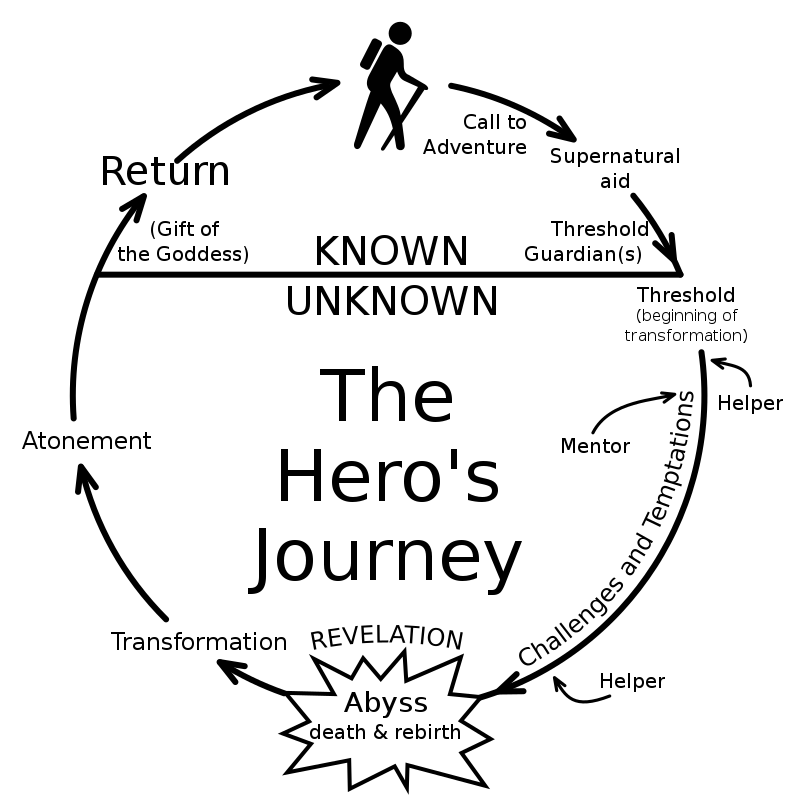

# Library usage tutorial

## Model

The library allows using text as an input to a Keras model in an easy way. All the building blocks are considered models, although not all models are the same kind the share some similarities.

All the models are in the package :py:mod:`gianlp.models`.

### Shared methods/properties

* :py:meth:`~.BaseModel.serialize`:
This method can be called on any model and will return a byte array that contains all the information needed for loading it again.

* :py:meth:`BaseModel.deserialize(data: bytes) <~.BaseModel.deserialize>`:
The :class:`BaseModel <gianlp.models.base_model.BaseModel>` class has a method that given any byte array that was the result of a serialize call rebuilds the original object serialized.

* :py:meth:`~.BaseModel.build`:
All models have to be built calling this method explicitly with a corpus for the models to learn about the language. The behaviour of this will vary depending on the texts representations used.

* :py:meth:`~.BaseModel.weights_amount`:
All models from the library when built contain a keras model inside, this method computes how many weights the model has.

* :py:meth:`~.BaseModel.trainable_weights_amount`:
This is the amount of weights that are trainable

* :py:meth:`~.BaseModel.inputs_shape`:
This retrieves the inputs shapes of the model. If there's only one input it will return a :class:`ModelIOShape <gianlp.models.base_model.ModelIOShape>` object, if there are multiple inputs it will return a list of :class:`ModelIOShape <gianlp.models.base_model.ModelIOShape>` objects.
A :class:`ModelIOShape <gianlp.models.base_model.ModelIOShape>` is similar to the :class:`tensorflow.TensorShape` object, contains two properties:
  * :obj:`~.ModelIOShape.shape` a tuple of ints indicating the shape
  * :obj:`~.ModelIOShape.dtype` the type of the input (for example :obj:`tf.int32`)

* :obj:`~.BaseModel.outputs_shape`: The same as the inputs shape but for the model outputs.

### All models are callable

Let's assume you have __any__ model instantiated and built:

```python
model = ... #model instantiation
model.build(corpus)
```

Now the model has some input and output shapes. Let's assume the input shapes are two int arrays of shape `(3,)` and `(2,2)`. We can call our model with two kinds of objects, keras layers and numpy arrays.

With keras layers we can do something like this as we would do with any :class:`tensorflow.keras.models.Model`.

```python
from tensorflow.keras.layers import Input

input1 = Input((3,), dtype='int32')
input2 = Input((2,2), dtype='int32')

model_output = model([input1, input2])
```

And then we may use the model output (with shape as specified in :py:meth:`model.outputs_shape <~.BaseModel.outputs_shape>`) in any keras model we like.

The other way of calling the model is with numpy arrays, this will forward the numpy array through the model.

```python
input numpy as np

input1 = np.asarray([1,4,3])
input2 = np.asarray([[3,5], [0,1]])

model_output = model([input1, input2])
```

Here model output would be a numpy array or list of numpy arrays (again, as specified in :py:meth:`model.outputs_shape <~.BaseModel.outputs_shape>`).

### All models know how to preprocess text

Any model from out library knows how to compute text into numbers that are interpretable for the inputs. With input shapes `(3,)` and `(2,2)` an example would be:

```python
preprocessed = model.preprocess_texts(["hi this is an example", 
                                       "still an example"])
```

This will return a list with of arrays of shape `(2,3)` and `(2,2,2)` where the first dimension is the amount of texts. This can be used for calling the model and evaluate the model although for _trainable models_ we will have a `.predict` method much more recommended.

### All models are printable

Finally, any model can be printed or converted to string returning a summary similar to keras :meth:`summary()` method.

## Text representation models

The models are going to be built using _text representation_ models as input to _trainable models_, this is the first kind of building blocks we want to learn.

A text representation is a way to transform a text into numbers for the neural network to use.

### Word representations

#### Pre trained word embedding

| Name              | Value                                      |
|-------------------|--------------------------------------------|
| Trainable weights | 0                                          |
| Input shape       | (# sequence maxlen,)                       |
| Output shape      | (# sequence maxlen, #embedding dimensions) |


This is one of the simplest and most famous text representations. It basically chunks each text in words or tokens and then uses a vector as the representation of each word. Similar words are closer together in cosine distance.

If we have a pretrained embedding we can use the class :class:`~.PreTrainedWordEmbeddingSequence` as a text input. The parameters for instantiating it are:
* word2vec_src: this can be either a path to a txt file in word2vec format or a gensim KeyedVectors object.
* tokenizer: this is a function used for tokenizing the texts, knows how to transform a string into a list of tokens. Must be possible to serialize it with pickle.
* sequence_maxlen: the maximum length in words for the generated word sequences

So, let's assume you have a word embedding of 150 dimensions for each word with a max length of 20. The model will internally chunk each text in words and transform them to it's corresponding embeddings. 
* If the model does not know the word a special embedding for unknown words will be assigned. The resulting output shape would be (20,150) for each text.
* If the text has less than 20 words the remaining embedding will be filled with a 0s vector of 150 dimension. This is referred as a _mask_, but beware, the mask is only the 0 vectors, the output has no keras masking (in the meaning of using `mask=True` in the embedding layer or using a `Masking` layer). This is not a bug, it's a feature, keras masking don't behave friendly with convolutions so __no text representation implements keras masking__, just vectors of zeros at the end. If you want an RNN to stop forwarding when the text finished you will have to add an explicit `Masking(0.0)` layer in front of it, or use our :class:`.RNNDigest` _trainable model_, but we'll be covering that later.

No embedding in this layer is trainable since this are pretrained, for trainable word embedding or transfer learning word embeddings we have another object.

#### Trainable word embedding

| Name              | Value                                          |
|-------------------|------------------------------------------------|
| Trainable weights | 0 to (#vocabulary + 1) x #embedding dimensions |
| Input shape       | (# sequence maxlen,)                           |
| Output shape      | (# sequence maxlen, #embedding dimensions)     |

The class of this one is :class:`.TrainableWordEmbeddingSequence`. It's another word embedding allowing trainablity, before explaining it parameters I will explain it's behaviour. This object, as in the :class:`.PreTrainedWordEmbeddingSequence`, can receive a pre trained embedding but it's optional.
The behaviour of this embedding is the following:

1. It learns the vocabulary by learning the most common words in build time. 
2. For each word in the vocabulary:
   * If a pretrained word embedding is provided and the word is there the vector for that word is taken from the pretrained embeddings.
   * If no pretrained embedding is provided or the word is not known in the pretrained embedding a random vector is assigned for that word.

The result is an embedding matrix with two groups, the previously known embeddings and the new word embeddings with the following properties:
* The new word embeddings are ALWAYS trainable.
* The previously known embeddings can or cannot be trainable by user choice.
* The embedding assigned to unknown words that may appear in training or inference time is ALWAYS trainable.

Summarizing all this we have three modes for using this object:
* Transfer learning: with pretrained embeddings
  * Pretrained embeddings frozen
  * Pretrained embeddings trainable
* All vectors trainable

We do NOT recommend using this object without pretrained embeddings, this will result in a lot of trainable weights and a very probable overfitting. Also this vectors will contain the information regarding the task trained but will not be real embeddings by definition.

Knowing the behaviour, the parameters for initializing the object are:

* tokenizer: this is a function used for tokenizing the texts, knows how to transform a string into a list of tokens. Must be possible to serialize it with pickle.
* word2vec_src: optional path to word2vec format .txt file or gensim KeyedVectors.
* min_freq_percentile: a common practice when building word embeddings is fixing a vocabulary size, but, how will you know which number to use? Our library uses a minimum percentile for this, any word that has a frequency of less than this percentile will not be in the vocabulary (i.e. if min_freq_percentile is 5 the 95% most frequent words will be kept)
* max_vocabulary: this is an optional int for the maximum size of the vocabulary. Can be mixed with the limit imposed by min_freq_percentile. If min_freq_percentile is 0 this will be the only limit (i.e. the vocabulary will be the `max_vocabulary` most common words).
* embedding_dimension: the dimension of the target embedding
* sequence_maxlen: the maximum allowed sequence length
* pretrained_trainable: if the vectors pretrained will also be trained. ignored if word2vec_src is None
* random_state: the random seed used for random processes

The behaviour for 0 padding, masking and unknown words is the same as in the :class:`.PreTrainedWordEmbeddingSequence` class.

#### Fasttext embedding sequence

| Name              | Value                                      |
|-------------------|--------------------------------------------|
| Trainable weights | #embedding dimensions                      |
| Input shape       | (# sequence maxlen,)                       |
| Output shape      | (# sequence maxlen, #embedding dimensions) |

Fasttext is a way of building word embeddings using ngrams. For example let's assume you have the word `automagical`, we can split it in `au`-`to`-`ma`-`gi`-`cal`, then learn representations for each ngram such as when every ngram vector get's summed up the vector for `automagical` makes sense.

If we train this with a big corpus then we have a good embedding generator for words that may not have appeared in the training set, because we can always split a word in it's ngrams and then sum them.

Sadly there's no performant way to compute new vectors for each word, unknown or not, using keras. We need to have a discrete and defined vocabulary, so, given a pretrained fasttext our object does the following:

1. In build time creates the vocabulary using the most common words with the same parameters as :class:`.TrainableWordEmbeddingSequence`.
2. Computes the word embedding for each word of the vocabulary.
3. Creates a random vector to initialize the embedding for future unknown words.

The resulting embedding matrix will be padded at 0, all vectors generated from fasttext will be fixed. The unknown word vector is **always** trainable.

The initialization parameters of :class:`.FasttextEmbeddingSequence` are:

* tokenizer: this is a function used for tokenizing the texts, knows how to transform a string into a list of tokens. Must be possible to serialize it with pickle.
* fasttext_src: path to **.bin** facebook format fasttext or gensim FastText object.
* sequence_maxlen: the maximum allowed sequence length
* min_freq_percentile: minimum percentile for vocabulary building, any word that has a frequency of less than this percentile will not be in the vopcabulary (i.e. if min_freq_percentile is 0.05 the 95% most frequent words will be kept)
* max_vocabulary: optional, maximum vocabulary size
* random_state: the random seed used for random processes

### Char representations

#### Char embedding sequence

| Name              | Value                                          |
|-------------------|------------------------------------------------|
| Trainable weights | (#char vocabulary + 1) x #embedding dimensions |
| Input shape       | (# sequence maxlen,)                           |
| Output shape      | (# sequence maxlen, #embedding dimensions)     |

The :class:`.CharEmbeddingSequence` object chunks each text into chars and transform each char to a vector. In build time learns the most common chars. All vectors are trainable.

The initialization parameters are:
* embedding_dimension: the target char embedding dimension
* sequence_maxlen: the maximum allowed sequence length
* min_freq_percentile: minimum percentile of the frequency for keeping a char when building the vocabulary
* random_state: random seed for embedding initialization

### Other representations

#### Chars per word sequence

| Name              | Value                                                  |
|-------------------|--------------------------------------------------------|
| Trainable weights | #char vocabulary x #embedding dimensions               |
| Input shape       | (# words maxlen, #chars maxlen)                        |
| Output shape      | (# words maxlen, #chars maxlen, #embedding dimensions) |


One very common way of using char embeddings is learning representations for OOV (out of vocabulary) words. To do this we can consider each word a sequence of char embeddings and the transform that sequence into one vector for each word. `CharPerWordEmbeddingSequence` gives us that first chars-per-word representation so we can transform it to word vector the way we want.

The initialization parameters are:
* tokenizer: the word tokenizer needed for spliting the text into words before spliting each word in chars
* embedding_dimension: the target char embedding dimension
* word_maxlen: the maximum length of word sequence
* char_maxlen: the maximum length in chars for each word
* min_freq_percentile: minimum percentile of the frequency for keeping a char when building the vocabulary
* random_state: random seed for initialization

In all our objects masking are vectors of zeros, if you need keras masking you can use the keras `Masking` layer before feeding your layers. Beware, if you compute the final vector for each word be sure that the resulting word vector is all zeros if all the sequence char vectors were 0, we want to keep the mapping of a word that didn't exist as a zero vector so we can use masking over the word sequence too. How can i make sure of this? Use CNNs and RNNs with NO biases, you actually don't really need biases, since the vectors are trainable.

#### Per chunk sequencer

| Name              | Value                                                 |
|-------------------|-------------------------------------------------------|
| Trainable weights | the same as the text representation used              |
| Input shape       | (# chunk maxlen, ) + text representation input shape  |
| Output shape      | (# chunk maxlen, ) + text representation output shape |


Let's imagine you want to split a text into paragraphs, then sentences, then words, then chars per word. Our library supports the full extent of your schizophrenic wishes, that's why we have a :class:`.PerChunkSequencer`.

The per chunk sequencer accept's any other text representation and a chunker and applies the text representation along the chunks of the text. The parameters for initializing it are:

* sequencer: the text representation model to use
* chunker: the picklelizable function that chunks a text into a list of texts
* chunking_maxlen: the maximum length in amount of chunks allowed

For easier understanding here is an example. The hero's journey or monomyth is a template followed by a lot of stories for the progression of a hero. It was and is widely used in some of the most influential fictions of the western culture, like "Shrek" the movie.
Along different stories some steps of the monomyth are present and other aren't and some heroes may go back a couple of steps sometimes.



We have teamed up with a literature expert and we classified paragraphs of multiple fictions. We want to classify new fictional pieces to find all this steps.

We could work this as a word sequence, but that won't work as good as with paragraphs because that's the minimal unit we want to classify. We are trying to detect higher level sequences, it is too much to ask for a model to learn the transition between steps as a transition of words. Treating this as a word sequence problem would be like making a topic classifier by classifying the words individually.

We are going to build a structured classifier, where the sequences would be for each paragraph, for each sentence, for each word two representations: a fasttext and a char per word one. Then we could use a BiLSTM-CRF to detect the label of each paragraph and capture the transition probability between steps. Let's work with the text representations:

```python
from my_utils import paragraph_chunker, sentence_chunker, word_tokenizer
```

We have somewhere a paragraph chunker (a function that splits text by paragraphs), a sentence chunker (we could use the one in nltk) and a word tokenizer. We said we were going to use chars per word and fasttext word embedding, let's first build the char per word representation:

```python
char_per_word_repr = CharPerWordEmbeddingSequence(word_tokenizer, embedding_dimension=32, word_maxlen=40, char_maxlen=12)
charword_per_sentence = PerChunkSequencer(char_per_word_repr, sentence_chunker, chunking_maxlen=50)
charword_per_paragraph = PerChunkSequencer(charword_per_sentence, paragraph_chunker, chunking_maxlen=1000)
```

To understand a little bit more:
* char_per_word_repr has output shape of `(40,12,32)`
* charword_per_sentence has output shape of `(50,40,12,32)`
* charword_per_paragraph has output shape of `(1000,50,40,12,32)`

Now we can learn with convolutions a representation for each word given the char sequence, using the _trainable models_ this will be easy and we will se examples of this.

```python
chars_word_digest = CNN(charword_per_paragraph)
```

With this pseudocode we have digested the last two dimensions of `(12,32)` in a vector of dimension 50. The resulting dimension of `chars_word_digest` is `(1000,50,40,50)`.
Doing something similar for the fasttext sequence we can obtain a sequence of let's say `(1000,50,40,100)`
Now we can concatenate the two and obtain a vector of 150 dimensions per word `(1000,50,40,150)`.

After that we may obtain with a RNN a vector per sentence of 300 dimensions resulting in a shape of `(1000,50,300)`.

Finally with another RNN we obtain a vector of 500 dimensions per paragraph `(1000,500)`. Now we just need a BiLSTM-CRF at the end.

And there it is, the architecture for a hero's journey structured classifier. This kind of classifier for high level structures are not common in the industry but are not impossible to find either. The key for this cases is how easy we built up the high level structure without having to think about preprocessing (i dare you to write this text preprocessor without bugs at the first try, i can't, specially considering the stories need to be fed the neural network using a generator for ram issues). 
Digesting those shapes with high _ndims_ will be equally easier when we reach the _trainable models_ section of the tutorial.

#### Mapping embedding

| Name              | Value                    |
|-------------------|--------------------------|
| Trainable weights | 0                        |
| Input shape       | (1,)                     |
| Output shape      | (#embedding dimensions,) |


Sometimes we may have a single embedding for each unique item, for categories, items, ids, users, whatever. With the :class:`.MappingEmbedding` we can treat the text as a key to a single vector (not a sequence).

The parameter for initializing it is just:

* word2vec_src: a word2vec format .txt file indicating which text has which embedding or a KeyedVectors gensim object

## Trainable models

### Common methods

The common methods in all trainable models are:

#### compile
:py:meth:`~.TrainableModel.compile` is a method for compiling the model following the same parameters as keras models. Previous building is required.

#### fit
For training the model, building and compiling is required.

:py:meth:`~.TrainableModel.fit` is the method for training the model, very similar to keras.

No matter which format is used for x or validation data, the model is always internally trained with a generator so if batch size elements can fit in ram when preprocessed you will have no ram issues.
Multi-text models only accept dicts and dataframes in x and simple-text models only series or lists.

:class:`.TrainableModel` supports the use of multiprocessing along with generators or inheriting our own :class:`gianlp.utils.Sequence`.

#### predict

:py:meth:`~.TrainableModel.predict` supports the same formats as :py:meth:`~.TrainableModel.fit` along with multiprocessing too! 

If the data is in the form of plain texts, an inference batch must be set.

#### freeze

:py:meth:`~.TrainableModel.freeze` is inplace, freezes the model's weights (can't be undone).

### Keras Wrapper

The :class:`.KerasWrapper` as the name says is a wrapper for any keras model.

This wrapper can accept inputs in multiple ways. 

The initialization parameters are:

* inputs: the models that are the input of this one. Either a list containing model inputs one by one or a dict indicating which text name is assigned to which inputs. If a list, all should have multi-text input or don't have it. If it's a dict all shouldn't have multi-text input.
* wrapped_model: the keras model to wrap. if it has multiple inputs, inputs parameter should have the same len

#### Examples

Given the following text representations:

```python
from nltk import word_tokenize

char_emb = CharEmbeddingSequence(embedding_dimension=32, sequence_maxlen=20, min_freq_percentile=5)
char_emb_per_word = CharPerWordEmbeddingSequence(word_tokenize, embedding_dimension=32, word_maxlen=10, char_maxlen=8, min_freq_percentile=5)
```

We know that `char_emb` has an output shape of `(20,32)` and `char_emb_per_word` of `(10,8,32)`.

Let's see a few examples:

##### Example 1: one input

```python
from tensorflow.keras.models import Sequential, Model
from tensorflow.keras.layers import Dense, Input, LSTM, Conv1D, GlobalMaxPooling1D, Concatenate
from gianlp.models import KerasWrapper

model = Sequential()
model.add(Input((20,32)))
model.add(GlobalMaxPooling1D())
model.add(Dense(1, activation='sigmoid'))

model = KerasWrapper(char_emb, model)
```

The output shape would be `(1,)` and the input shape `(20,)` (same as `char_emb` input shape).

After that if we want to train this model we need to build it, which will build always all the graph, including all models chained. We then compile it and use the fit method.

##### Example 2: classifier per word

```python
model = Sequential()
model.add(Input((8,32)))
model.add(GlobalMaxPooling1D())
model.add(Dense(1, activation='sigmoid'))

model = KerasWrapper(char_emb_per_word, model)
```

The output shape would be `(10,1)` and the input shape `(10,8)`. Here we can see that the wrapper knows how to automatically adapt the input of the model as time distributed over the representation output without telling it explicitly.

KerasWrapper will assume that any extra ndim (when possible and shapes compatible) needs a time distribution over each extra dimension.

##### Example 3: Multiple inputs, chaining and automatic concatenation

```python
encoder1 = Sequential()
encoder1.add(Input((20,32)))
encoder1.add(GlobalMaxPooling1D())
encoder1.add(Dense(20, activation='tanh'))
encoder1 = KerasWrapper(char_emb, encoder1)

encoder2 = Sequential()
encoder2.add(Input((10,8,32)))
encoder2.add(Conv1D(10))
encoder2.add(GlobalMaxPooling1D())
encoder2.add(Conv1D(10))
encoder2.add(GlobalMaxPooling1D())
encoder2.add(Dense(20, activation='tanh'))
encoder2 = KerasWrapper(char_emb_per_word, encoder2)
```

* `encoder1` has input shape `(20,)` and output shape `(20,)`.
* `encoder2` has input shape `(10,8)` and output shape `(20,)`.

We want to build a classifier using this two encoding of the texts.

```python
classifier = Sequential()
classifier.add(Input((40,)))
classifier.add(Dense(1, activation='tanh'))
classifier = KerasWrapper([encoder1, encoder2], classifier)
```

`classifier` has two inputs, since the keras model input has dimension (40,) the wrapper realizes it needs to concatenate the outputs of both encoder. We can also build the keras model this way with the same result:

```python
inp1 = Input(20,)
inp2 = Input(20,)
concat = Concatenate()([inp1, inp2])
out = Dense(1, activation='sigmoid')(concat)
classifier = Model(inputs=[inp1, inp2], outputs=out)
classifier = KerasWrapper([encoder1, encoder2], classifier)
```

Either way the result is the same. `classifier` will have inputs shapes `[(20,), (10,8)]` and output shape `(1,)`.

We can always chain as many models as we want.

##### Example 4: Multi-text input

```python
encoder = Sequential()
encoder.add(Input((20,32)))
encoder.add(GlobalMaxPooling1D())
encoder.add(Dense(20, activation='tanh'))
encoder = KerasWrapper(char_emb, encoder)
```

`encoder` has input shape `(20,)` and outputs shape `(20,)`.

We want to train a siamese network but using two different texts.

```python
classifier = Sequential()
classifier.add(Input((40,)))
classifier.add(Dense(1, activation='sigmoid'))
classifier = KerasWrapper([('text1', [encoder]), ('text2', [encoder])], classifier)
```

`classifier` has inputs shapes `[(20,), (20,)]`.
Since this classifier is multi-text it need to be fed to the two different texts, so `fit` and `predict` no longer accept lists or pandas Series, it needs dict of lists or Dataframes.

#### More examples

Real examples involving fiting and predicting are in next pages of this tutorial.

### RNNDigest

:class:`.RNNDigest` is an easier way of digesting sequences in deep-RNNs but in reality is another implementation of :class:`.KerasWrapper`.

Its initialization parameters are:

* inputs: the inputs of the model
* units_per_layer: the amount of units per layer
* rnn_type: the type of rnn, could be "gru" or "lstm"
* stacked_layers: the amount of layers to stack, 1 by default
* masking: if apply masking with 0 to the sequence
* bidirectional: if it's bidirectional
* random_seed: the seed for random processes
* return_sequences: if True, the last RNN layer returns the sequence of states